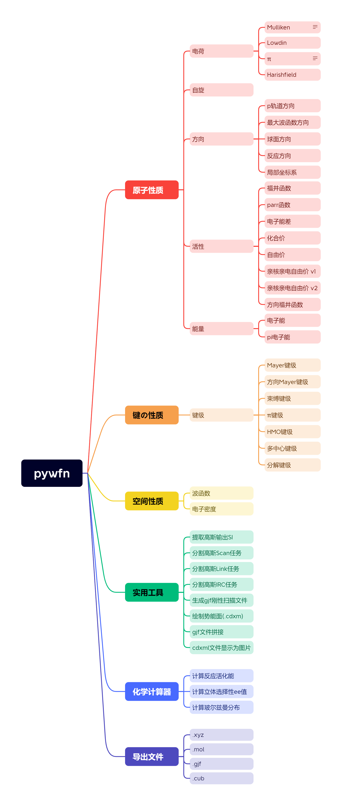

# `pywfn` -- 基于python的波函数分析工具

文档： https://www.xiaofei911.top/mkdocs/pywfn/


## 依赖
```
numpy>=2.1.1
rich>=13.8.0
matplotlib>=3.9.2
```
## 运行(CLI)
``` shell
python main.py
```

## 示例(API)
```python
from pywfn.base import Mole
from pywfn.reader import LogReader
from pywfn.atomprop import charge

path="D:\BaiduSyncdisk\gfile\CnHn\C6H6.log" # 高斯输出文件的路径
reader=LogReader(path) # 实例化log文件读取器
mol=Mole(reader) # 实例化分子对象

caler=charge.Calculator(mol) # 实例化原子电荷计算器，传入分子对象
result=caler.mulliken() # 计算mulliken电荷
print(result) # 打印结果
```

## 功能


