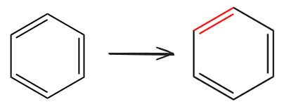

```python
import sys;sys.path.append('d:/code/pywfn')
```

# 实用工具
定义了一些基于文件读取和分子基类的功能类，功能比较杂，可能会经常改变

所有的相关模块都定义在`pywfn.tools`子包下

## gjf
包含了对gjf文件进行快速处理的函数

### 拼接多个gjf文件
这个没啥技术难度，就是将多个gjf拼接在一起，只不过写出来方便cli中快速使用

**示例代码**

下面代码将两个相同的gjf文件拼接在一起，并返回拼接后的文本


```python
from pywfn.tools.gjf import Tool as GjfTool

paths=[
    './mols/C6H6.gjf',
    './mols/C6H6.gjf'
]

tool=GjfTool()
text=tool.join(paths)
print(text)
```

    %chk=D:\code\pywfn\tutori\mols\C6H6.chk
    # b3lyp/6-31g(d) pop=full gfinput iop(3/33=1)
    
    Title Card Required
    
    0 1
     C                  0.00000000    1.40140000    0.00000000
     C                  1.21364800    0.70070000    0.00000000
     C                  1.21364800   -0.70070000    0.00000000
     C                  0.00000000   -1.40140000    0.00000000
     C                 -1.21364800   -0.70070000    0.00000000
     C                 -1.21364800    0.70070000    0.00000000
     H                  0.00000000    2.47140000    0.00000000
     H                  2.14029500    1.23570000    0.00000000
     H                  2.14029500   -1.23570000    0.00000000
     H                  0.00000000   -2.47140000    0.00000000
     H                 -2.14029500   -1.23570000    0.00000000
     H                 -2.14029500    1.23570000    0.00000000
    
    --Link1--
    
    %chk=D:\code\pywfn\tutori\mols\C6H6.chk
    # b3lyp/6-31g(d) pop=full gfinput iop(3/33=1)
    
    Title Card Required
    
    0 1
     C                  0.00000000    1.40140000    0.00000000
     C                  1.21364800    0.70070000    0.00000000
     C                  1.21364800   -0.70070000    0.00000000
     C                  0.00000000   -1.40140000    0.00000000
     C                 -1.21364800   -0.70070000    0.00000000
     C                 -1.21364800    0.70070000    0.00000000
     H                  0.00000000    2.47140000    0.00000000
     H                  2.14029500    1.23570000    0.00000000
     H                  2.14029500   -1.23570000    0.00000000
     H                  0.00000000   -2.47140000    0.00000000
     H                 -2.14029500   -1.23570000    0.00000000
     H                 -2.14029500    1.23570000    0.00000000
    
    --Link1--
    
    %chk=D:\code\pywfn\tutori\mols\C6H6.chk
    # b3lyp/6-31g(d) pop=full gfinput iop(3/33=1)
    
    Title Card Required
    
    0 1
     C                  0.00000000    1.40140000    0.00000000
     C                  1.21364800    0.70070000    0.00000000
     C                  1.21364800   -0.70070000    0.00000000
     C                  0.00000000   -1.40140000    0.00000000
     C                 -1.21364800   -0.70070000    0.00000000
     C                 -1.21364800    0.70070000    0.00000000
     H                  0.00000000    2.47140000    0.00000000
     H                  2.14029500    1.23570000    0.00000000
     H                  2.14029500   -1.23570000    0.00000000
     H                  0.00000000   -2.47140000    0.00000000
     H                 -2.14029500   -1.23570000    0.00000000
     H                 -2.14029500    1.23570000    0.00000000
    
    --Link1--
    
    %chk=D:\code\pywfn\tutori\mols\C6H6.chk
    # b3lyp/6-31g(d) pop=full gfinput iop(3/33=1)
    
    Title Card Required
    
    0 1
     C                  0.00000000    1.40140000    0.00000000
     C                  1.21364800    0.70070000    0.00000000
     C                  1.21364800   -0.70070000    0.00000000
     C                  0.00000000   -1.40140000    0.00000000
     C                 -1.21364800   -0.70070000    0.00000000
     C                 -1.21364800    0.70070000    0.00000000
     H                  0.00000000    2.47140000    0.00000000
     H                  2.14029500    1.23570000    0.00000000
     H                  2.14029500   -1.23570000    0.00000000
     H                  0.00000000   -2.47140000    0.00000000
     H                 -2.14029500   -1.23570000    0.00000000
     H                 -2.14029500    1.23570000    0.00000000
    
    --Link1--
    
    %chk=D:\code\pywfn\tutori\mols\C6H6.chk
    # b3lyp/6-31g(d) pop=full gfinput iop(3/33=1)
    
    Title Card Required
    
    0 1
     C                  0.00000000    1.40140000    0.00000000
     C                  1.21364800    0.70070000    0.00000000
     C                  1.21364800   -0.70070000    0.00000000
     C                  0.00000000   -1.40140000    0.00000000
     C                 -1.21364800   -0.70070000    0.00000000
     C                 -1.21364800    0.70070000    0.00000000
     H                  0.00000000    2.47140000    0.00000000
     H                  2.14029500    1.23570000    0.00000000
     H                  2.14029500   -1.23570000    0.00000000
     H                  0.00000000   -2.47140000    0.00000000
     H                 -2.14029500   -1.23570000    0.00000000
     H                 -2.14029500    1.23570000    0.00000000
    
    --Link1--
    
    %chk=D:\code\pywfn\tutori\mols\C6H6.chk
    # b3lyp/6-31g(d) pop=full gfinput iop(3/33=1)
    
    Title Card Required
    
    0 1
     C                  0.00000000    1.40140000    0.00000000
     C                  1.21364800    0.70070000    0.00000000
     C                  1.21364800   -0.70070000    0.00000000
     C                  0.00000000   -1.40140000    0.00000000
     C                 -1.21364800   -0.70070000    0.00000000
     C                 -1.21364800    0.70070000    0.00000000
     H                  0.00000000    2.47140000    0.00000000
     H                  2.14029500    1.23570000    0.00000000
     H                  2.14029500   -1.23570000    0.00000000
     H                  0.00000000   -2.47140000    0.00000000
     H                 -2.14029500   -1.23570000    0.00000000
     H                 -2.14029500    1.23570000    0.00000000
    
    --Link1--
    
    %chk=D:\code\pywfn\tutori\mols\C6H6.chk
    # b3lyp/6-31g(d) pop=full gfinput iop(3/33=1)
    
    Title Card Required
    
    0 1
     C                  0.00000000    1.40140000    0.00000000
     C                  1.21364800    0.70070000    0.00000000
     C                  1.21364800   -0.70070000    0.00000000
     C                  0.00000000   -1.40140000    0.00000000
     C                 -1.21364800   -0.70070000    0.00000000
     C                 -1.21364800    0.70070000    0.00000000
     H                  0.00000000    2.47140000    0.00000000
     H                  2.14029500    1.23570000    0.00000000
     H                  2.14029500   -1.23570000    0.00000000
     H                  0.00000000   -2.47140000    0.00000000
     H                 -2.14029500   -1.23570000    0.00000000
     H                 -2.14029500    1.23570000    0.00000000
    
    --Link1--
    
    %chk=D:\code\pywfn\tutori\mols\C6H6.chk
    # b3lyp/6-31g(d) pop=full gfinput iop(3/33=1)
    
    Title Card Required
    
    0 1
     C                  0.00000000    1.40140000    0.00000000
     C                  1.21364800    0.70070000    0.00000000
     C                  1.21364800   -0.70070000    0.00000000
     C                  0.00000000   -1.40140000    0.00000000
     C                 -1.21364800   -0.70070000    0.00000000
     C                 -1.21364800    0.70070000    0.00000000
     H                  0.00000000    2.47140000    0.00000000
     H                  2.14029500    1.23570000    0.00000000
     H                  2.14029500   -1.23570000    0.00000000
     H                  0.00000000   -2.47140000    0.00000000
     H                 -2.14029500   -1.23570000    0.00000000
     H                 -2.14029500    1.23570000    0.00000000
    
    
    

### 环心添加Bq原子
为了方便计算NICS值，可以在gjf在环心自动添加Bq原子

**示例代码**

下列代码在苯环中心添加了`Bq`原子，并获取到了修改后的`gjf`文本


```python
from pywfn.tools.gjf import Tool as GjfTool
from pathlib import Path
path='./mols/C6H6.gjf'
print(Path(path).read_text()) # 原始的gjf文件内容
tool=GjfTool()
rings=[
    [1,2,3,4,5,6]
]
print('-'*50)
text=tool.ringBq(path,rings)
print(text) #修改后的gjf文件内容
```

    %chk=D:\code\pywfn\tutori\mols\C6H6.chk
    # b3lyp/6-31g(d) pop=full gfinput iop(3/33=1)
    
    Title Card Required
    
    0 1
     C                  0.00000000    1.40140000    0.00000000
     C                  1.21364800    0.70070000    0.00000000
     C                  1.21364800   -0.70070000    0.00000000
     C                  0.00000000   -1.40140000    0.00000000
     C                 -1.21364800   -0.70070000    0.00000000
     C                 -1.21364800    0.70070000    0.00000000
     H                  0.00000000    2.47140000    0.00000000
     H                  2.14029500    1.23570000    0.00000000
     H                  2.14029500   -1.23570000    0.00000000
     H                  0.00000000   -2.47140000    0.00000000
     H                 -2.14029500   -1.23570000    0.00000000
     H                 -2.14029500    1.23570000    0.00000000
    
    --Link1--
    
    %chk=D:\code\pywfn\tutori\mols\C6H6.chk
    # b3lyp/6-31g(d) pop=full gfinput iop(3/33=1)
    
    Title Card Required
    
    0 1
     C                  0.00000000    1.40140000    0.00000000
     C                  1.21364800    0.70070000    0.00000000
     C                  1.21364800   -0.70070000    0.00000000
     C                  0.00000000   -1.40140000    0.00000000
     C                 -1.21364800   -0.70070000    0.00000000
     C                 -1.21364800    0.70070000    0.00000000
     H                  0.00000000    2.47140000    0.00000000
     H                  2.14029500    1.23570000    0.00000000
     H                  2.14029500   -1.23570000    0.00000000
     H                  0.00000000   -2.47140000    0.00000000
     H                 -2.14029500   -1.23570000    0.00000000
     H                 -2.14029500    1.23570000    0.00000000
    
    --Link1--
    
    %chk=D:\code\pywfn\tutori\mols\C6H6.chk
    # b3lyp/6-31g(d) pop=full gfinput iop(3/33=1)
    
    Title Card Required
    
    0 1
     C                  0.00000000    1.40140000    0.00000000
     C                  1.21364800    0.70070000    0.00000000
     C                  1.21364800   -0.70070000    0.00000000
     C                  0.00000000   -1.40140000    0.00000000
     C                 -1.21364800   -0.70070000    0.00000000
     C                 -1.21364800    0.70070000    0.00000000
     H                  0.00000000    2.47140000    0.00000000
     H                  2.14029500    1.23570000    0.00000000
     H                  2.14029500   -1.23570000    0.00000000
     H                  0.00000000   -2.47140000    0.00000000
     H                 -2.14029500   -1.23570000    0.00000000
     H                 -2.14029500    1.23570000    0.00000000
    
    --Link1--
    
    %chk=D:\code\pywfn\tutori\mols\C6H6.chk
    # b3lyp/6-31g(d) pop=full gfinput iop(3/33=1)
    
    Title Card Required
    
    0 1
     C                  0.00000000    1.40140000    0.00000000
     C                  1.21364800    0.70070000    0.00000000
     C                  1.21364800   -0.70070000    0.00000000
     C                  0.00000000   -1.40140000    0.00000000
     C                 -1.21364800   -0.70070000    0.00000000
     C                 -1.21364800    0.70070000    0.00000000
     H                  0.00000000    2.47140000    0.00000000
     H                  2.14029500    1.23570000    0.00000000
     H                  2.14029500   -1.23570000    0.00000000
     H                  0.00000000   -2.47140000    0.00000000
     H                 -2.14029500   -1.23570000    0.00000000
     H                 -2.14029500    1.23570000    0.00000000
    
    --Link1--
    
    %chk=D:\code\pywfn\tutori\mols\C6H6.chk
    # b3lyp/6-31g(d) pop=full gfinput iop(3/33=1)
    
    Title Card Required
    
    0 1
     C                  0.00000000    1.40140000    0.00000000
     C                  1.21364800    0.70070000    0.00000000
     C                  1.21364800   -0.70070000    0.00000000
     C                  0.00000000   -1.40140000    0.00000000
     C                 -1.21364800   -0.70070000    0.00000000
     C                 -1.21364800    0.70070000    0.00000000
     H                  0.00000000    2.47140000    0.00000000
     H                  2.14029500    1.23570000    0.00000000
     H                  2.14029500   -1.23570000    0.00000000
     H                  0.00000000   -2.47140000    0.00000000
     H                 -2.14029500   -1.23570000    0.00000000
     H                 -2.14029500    1.23570000    0.00000000
    
    --Link1--
    
    %chk=D:\code\pywfn\tutori\mols\C6H6.chk
    # b3lyp/6-31g(d) pop=full gfinput iop(3/33=1)
    
    Title Card Required
    
    0 1
     C                  0.00000000    1.40140000    0.00000000
     C                  1.21364800    0.70070000    0.00000000
     C                  1.21364800   -0.70070000    0.00000000
     C                  0.00000000   -1.40140000    0.00000000
     C                 -1.21364800   -0.70070000    0.00000000
     C                 -1.21364800    0.70070000    0.00000000
     H                  0.00000000    2.47140000    0.00000000
     H                  2.14029500    1.23570000    0.00000000
     H                  2.14029500   -1.23570000    0.00000000
     H                  0.00000000   -2.47140000    0.00000000
     H                 -2.14029500   -1.23570000    0.00000000
     H                 -2.14029500    1.23570000    0.00000000
    
    --Link1--
    
    %chk=D:\code\pywfn\tutori\mols\C6H6.chk
    # b3lyp/6-31g(d) pop=full gfinput iop(3/33=1)
    
    Title Card Required
    
    0 1
     C                  0.00000000    1.40140000    0.00000000
     C                  1.21364800    0.70070000    0.00000000
     C                  1.21364800   -0.70070000    0.00000000
     C                  0.00000000   -1.40140000    0.00000000
     C                 -1.21364800   -0.70070000    0.00000000
     C                 -1.21364800    0.70070000    0.00000000
     H                  0.00000000    2.47140000    0.00000000
     H                  2.14029500    1.23570000    0.00000000
     H                  2.14029500   -1.23570000    0.00000000
     H                  0.00000000   -2.47140000    0.00000000
     H                 -2.14029500   -1.23570000    0.00000000
     H                 -2.14029500    1.23570000    0.00000000
    
    --Link1--
    
    %chk=D:\code\pywfn\tutori\mols\C6H6.chk
    # b3lyp/6-31g(d) pop=full gfinput iop(3/33=1)
    
    Title Card Required
    
    0 1
     C                  0.00000000    1.40140000    0.00000000
     C                  1.21364800    0.70070000    0.00000000
     C                  1.21364800   -0.70070000    0.00000000
     C                  0.00000000   -1.40140000    0.00000000
     C                 -1.21364800   -0.70070000    0.00000000
     C                 -1.21364800    0.70070000    0.00000000
     H                  0.00000000    2.47140000    0.00000000
     H                  2.14029500    1.23570000    0.00000000
     H                  2.14029500   -1.23570000    0.00000000
     H                  0.00000000   -2.47140000    0.00000000
     H                 -2.14029500   -1.23570000    0.00000000
     H                 -2.14029500    1.23570000    0.00000000
    
    
    --------------------------------------------------
    %chk=C6H6_Bq.chk.chk
    # b3lyp/6-31g(d) NMR
    
    Title Card Required
    
    0 1
     C    0.00000000    1.40086102    0.00000000
     C    1.21318114    0.70043051    0.00000000
     C    1.21318114   -0.70043051    0.00000000
     C    0.00000000   -1.40086102    0.00000000
     C   -1.21318114   -0.70043051    0.00000000
     C   -1.21318114    0.70043051    0.00000000
     H    0.00000000    2.47044945    0.00000000
     H    2.13947177    1.23522472    0.00000000
     H    2.13947177   -1.23522472    0.00000000
     H    0.00000000   -2.47044945    0.00000000
     H   -2.13947177   -1.23522472    0.00000000
     H   -2.13947177    1.23522472    0.00000000
     C    0.00000000    1.40086102    0.00000000
     C    1.21318114    0.70043051    0.00000000
     C    1.21318114   -0.70043051    0.00000000
     C    0.00000000   -1.40086102    0.00000000
     C   -1.21318114   -0.70043051    0.00000000
     C   -1.21318114    0.70043051    0.00000000
     H    0.00000000    2.47044945    0.00000000
     H    2.13947177    1.23522472    0.00000000
     H    2.13947177   -1.23522472    0.00000000
     H    0.00000000   -2.47044945    0.00000000
     H   -2.13947177   -1.23522472    0.00000000
     H   -2.13947177    1.23522472    0.00000000
     C    0.00000000    1.40086102    0.00000000
     C    1.21318114    0.70043051    0.00000000
     C    1.21318114   -0.70043051    0.00000000
     C    0.00000000   -1.40086102    0.00000000
     C   -1.21318114   -0.70043051    0.00000000
     C   -1.21318114    0.70043051    0.00000000
     H    0.00000000    2.47044945    0.00000000
     H    2.13947177    1.23522472    0.00000000
     H    2.13947177   -1.23522472    0.00000000
     H    0.00000000   -2.47044945    0.00000000
     H   -2.13947177   -1.23522472    0.00000000
     H   -2.13947177    1.23522472    0.00000000
     C    0.00000000    1.40086102    0.00000000
     C    1.21318114    0.70043051    0.00000000
     C    1.21318114   -0.70043051    0.00000000
     C    0.00000000   -1.40086102    0.00000000
     C   -1.21318114   -0.70043051    0.00000000
     C   -1.21318114    0.70043051    0.00000000
     H    0.00000000    2.47044945    0.00000000
     H    2.13947177    1.23522472    0.00000000
     H    2.13947177   -1.23522472    0.00000000
     H    0.00000000   -2.47044945    0.00000000
     H   -2.13947177   -1.23522472    0.00000000
     H   -2.13947177    1.23522472    0.00000000
     C    0.00000000    1.40086102    0.00000000
     C    1.21318114    0.70043051    0.00000000
     C    1.21318114   -0.70043051    0.00000000
     C    0.00000000   -1.40086102    0.00000000
     C   -1.21318114   -0.70043051    0.00000000
     C   -1.21318114    0.70043051    0.00000000
     H    0.00000000    2.47044945    0.00000000
     H    2.13947177    1.23522472    0.00000000
     H    2.13947177   -1.23522472    0.00000000
     H    0.00000000   -2.47044945    0.00000000
     H   -2.13947177   -1.23522472    0.00000000
     H   -2.13947177    1.23522472    0.00000000
     C    0.00000000    1.40086102    0.00000000
     C    1.21318114    0.70043051    0.00000000
     C    1.21318114   -0.70043051    0.00000000
     C    0.00000000   -1.40086102    0.00000000
     C   -1.21318114   -0.70043051    0.00000000
     C   -1.21318114    0.70043051    0.00000000
     H    0.00000000    2.47044945    0.00000000
     H    2.13947177    1.23522472    0.00000000
     H    2.13947177   -1.23522472    0.00000000
     H    0.00000000   -2.47044945    0.00000000
     H   -2.13947177   -1.23522472    0.00000000
     H   -2.13947177    1.23522472    0.00000000
     C    0.00000000    1.40086102    0.00000000
     C    1.21318114    0.70043051    0.00000000
     C    1.21318114   -0.70043051    0.00000000
     C    0.00000000   -1.40086102    0.00000000
     C   -1.21318114   -0.70043051    0.00000000
     C   -1.21318114    0.70043051    0.00000000
     H    0.00000000    2.47044945    0.00000000
     H    2.13947177    1.23522472    0.00000000
     H    2.13947177   -1.23522472    0.00000000
     H    0.00000000   -2.47044945    0.00000000
     H   -2.13947177   -1.23522472    0.00000000
     H   -2.13947177    1.23522472    0.00000000
     C    0.00000000    1.40086102    0.00000000
     C    1.21318114    0.70043051    0.00000000
     C    1.21318114   -0.70043051    0.00000000
     C    0.00000000   -1.40086102    0.00000000
     C   -1.21318114   -0.70043051    0.00000000
     C   -1.21318114    0.70043051    0.00000000
     H    0.00000000    2.47044945    0.00000000
     H    2.13947177    1.23522472    0.00000000
     H    2.13947177   -1.23522472    0.00000000
     H    0.00000000   -2.47044945    0.00000000
     H   -2.13947177   -1.23522472    0.00000000
     H   -2.13947177    1.23522472    0.00000000
    Bq    0.00000000    0.00000002    0.00000000
    
    
    
    

### 刚性旋转扫描gjf
将gjf内的分子的一个键进行旋转扫描，生成多个结构拼接成一个gjf并返回文本

**示例代码**

下面代码将`1,3-丁二烯`按中间的键旋转10步，每步36°


```python
from pywfn.tools.gjf import Tool as GjfTool
import numpy as np

tool=GjfTool()
path='./mols/erxi.gjf'
text=tool.scan_bond(path,1,3,10,np.pi*2/10)
print(text)
```

    %chk=chk.chk
    # b3lyp/6-31g(d) pop=full gfinput iop(3/33=1)
    
    Title Card Required
    
    0 1
     C   -0.44141671    0.63055158    0.00000000
     H   -1.50694501    0.53744453    0.00000000
     C    0.44141671   -0.63055158    0.00000000
     H    1.50694501   -0.53744453    0.00000000
     C   -0.13122630   -1.85824633    0.00000000
     H   -1.19675469   -1.95135355    0.00000000
     H    0.48217094   -2.73446751    0.00000000
     C    0.13122629    1.85824633    0.00000000
     H   -0.48217094    2.73446751    0.00000000
     H    1.19675469    1.95135355    0.00000000
    
    
    --Link1--
    
    %chk=chk.chk
    # b3lyp/6-31g(d) pop=full gfinput iop(3/33=1)
    
    Title Card Required
    
    0 1
     C   -0.44141671    0.63055158    0.00000000
     H   -1.36202145    0.63889802    0.54446000
     C    0.44141671   -0.63055158    0.00000000
     H    1.50694501   -0.53744453    0.00000000
     C   -0.13122630   -1.85824633    0.00000000
     H   -1.19675469   -1.95135355    0.00000000
     H    0.48217094   -2.73446751    0.00000000
     C   -0.05232550    1.72975123   -0.68958151
     H   -0.66572273    2.60597229   -0.68958157
     H    0.86827922    1.72140479   -1.23404169
    
    
    --Link1--
    
    %chk=chk.chk
    # b3lyp/6-31g(d) pop=full gfinput iop(3/33=1)
    
    Title Card Required
    
    0 1
     C   -0.44141671    0.63055158    0.00000000
     H   -0.51362413    1.23281729    0.88095486
     C    0.44141671   -0.63055158    0.00000000
     H    1.50694501   -0.53744453    0.00000000
     C   -0.13122630   -1.85824633    0.00000000
     H   -1.19675469   -1.95135355    0.00000000
     H    0.48217094   -2.73446751    0.00000000
     C   -1.12685633    0.97752738   -1.11576641
     H   -1.74025357    1.85374832   -1.11576641
     H   -1.05464911    0.37526166   -1.99672139
    
    
    --Link1--
    
    %chk=chk.chk
    # b3lyp/6-31g(d) pop=full gfinput iop(3/33=1)
    
    Title Card Required
    
    0 1
     C   -0.44141671    0.63055158    0.00000000
     H   -0.13420928    1.49842620   -0.54446000
     C    0.44141671   -0.63055158    0.00000000
     H    1.50694501   -0.53744453    0.00000000
     C   -0.13122630   -1.85824633    0.00000000
     H   -1.19675469   -1.95135355    0.00000000
     H    0.48217094   -2.73446751    0.00000000
     C   -1.60740125    0.64112264    0.68958151
     H   -2.22079849    1.51734340    0.68958157
     H   -1.91460872   -0.22675191    1.23404157
    
    
    --Link1--
    
    %chk=chk.chk
    # b3lyp/6-31g(d) pop=full gfinput iop(3/33=1)
    
    Title Card Required
    
    0 1
     C   -0.44141671    0.63055158    0.00000000
     H   -1.50694501    0.53744447    0.00000000
     C    0.44141671   -0.63055158    0.00000000
     H    1.50694501   -0.53744453    0.00000000
     C   -0.13122630   -1.85824633    0.00000000
     H   -1.19675469   -1.95135355    0.00000000
     H    0.48217094   -2.73446751    0.00000000
     C    0.13122635    1.85824621    0.00000000
     H   -0.48217058    2.73446679    0.00000002
     H    1.19675457    1.95135331    0.00000003
    
    
    --Link1--
    
    %chk=chk.chk
    # b3lyp/6-31g(d) pop=full gfinput iop(3/33=1)
    
    Title Card Required
    
    0 1
     C   -0.44141671    0.63055158    0.00000000
     H    0.01071443    1.59987962   -0.00000000
     C    0.44141671   -0.63055158    0.00000000
     H    1.50694501   -0.53744453    0.00000000
     C   -0.13122630   -1.85824633    0.00000000
     H   -1.19675469   -1.95135355    0.00000000
     H    0.48217094   -2.73446751    0.00000000
     C   -1.79095292    0.51262730   -0.00000000
     H   -2.40434980    1.38884771   -0.00000002
     H   -2.24308419   -0.45670062   -0.00000003
    
    
    --Link1--
    
    %chk=chk.chk
    # b3lyp/6-31g(d) pop=full gfinput iop(3/33=1)
    
    Title Card Required
    
    0 1
     C   -0.44141671    0.63055158    0.00000000
     H   -1.36202133    0.63889784    0.54446006
     C    0.44141671   -0.63055158    0.00000000
     H    1.50694501   -0.53744453    0.00000000
     C   -0.13122630   -1.85824633    0.00000000
     H   -1.19675469   -1.95135355    0.00000000
     H    0.48217094   -2.73446751    0.00000000
     C   -0.05232529    1.72975099   -0.68958151
     H   -0.66572207    2.60597134   -0.68958151
     H    0.86827928    1.72140467   -1.23404157
    
    
    --Link1--
    
    %chk=chk.chk
    # b3lyp/6-31g(d) pop=full gfinput iop(3/33=1)
    
    Title Card Required
    
    0 1
     C   -0.44141671    0.63055158    0.00000000
     H   -0.98260641    0.90450662   -0.88095492
     C    0.44141671   -0.63055158    0.00000000
     H    1.50694501   -0.53744453    0.00000000
     C   -0.13122630   -1.85824633    0.00000000
     H   -1.19675469   -1.95135355    0.00000000
     H    0.48217094   -2.73446751    0.00000000
     C   -0.53287017    1.39334607    1.11576641
     H   -1.14626682    2.26956630    1.11576629
     H    0.00831946    1.11939108    1.99672115
    
    
    --Link1--
    
    %chk=chk.chk
    # b3lyp/6-31g(d) pop=full gfinput iop(3/33=1)
    
    Title Card Required
    
    0 1
     C   -0.44141671    0.63055158    0.00000000
     H   -0.13420908    1.49842584   -0.54446006
     C    0.44141671   -0.63055158    0.00000000
     H    1.50694501   -0.53744453    0.00000000
     C   -0.13122630   -1.85824633    0.00000000
     H   -1.19675469   -1.95135355    0.00000000
     H    0.48217094   -2.73446751    0.00000000
     C   -1.60740113    0.64112222    0.68958145
     H   -2.22079778    1.51734245    0.68958139
     H   -1.91460860   -0.22675197    1.23404145
    
    
    --Link1--
    
    %chk=chk.chk
    # b3lyp/6-31g(d) pop=full gfinput iop(3/33=1)
    
    Title Card Required
    
    0 1
     C   -0.44141671    0.63055158    0.00000000
     H    0.01071448    1.59987950   -0.00000005
     C    0.44141671   -0.63055158    0.00000000
     H    1.50694501   -0.53744453    0.00000000
     C   -0.13122630   -1.85824633    0.00000000
     H   -1.19675469   -1.95135355    0.00000000
     H    0.48217094   -2.73446751    0.00000000
     C   -1.79095280    0.51262712   -0.00000012
     H   -2.40434957    1.38884723   -0.00000015
     H   -2.24308372   -0.45670056   -0.00000007
    
    
    
    

## log工具
与log文件相关的各种工具函数

### 分割结构优化
将结构优化文件的各个步骤单独到处成独立的分子对象

**示例代码**

以下代码将结构优化过程中的每个结构提取出来并绘制能量变化曲线


```python
from pywfn.tools.log import Tool as LogTool
import matplotlib.pyplot as plt

tool=LogTool()
mols=tool.split_scan('./mols/C6H6_opt.out')
print(mols)
engs=[mol.energy for mol in mols]
plt.plot(engs)
```

    [<C6H6,12>, <C6H6,12>, <C6H6,12>, <C6H6,12>]
    


    [<matplotlib.lines.Line2D at 0x15d6d99a620>]


    

    


## xml
对chemdraw文件处理的相关函数

### ChemDraw分子绘制

将chendraw文件中的分子按照点和线绘制出来

**示例代码**


```python
from pywfn.tools import xml

path='mols/C6H6.cdxml'
tool=xml.Tool(path)
tool.show()
```


    

    


### ChemDraw分子染色

可以指定节点编号为边上颜色

**示例代码**

下面代码将苯环中的一条边变为红色


```python
from pywfn.tools import xml

path='mols/C6H6.cdxml'
tool=xml.Tool(path)
tool.set_color((2,4),(1.,0.,0.))
tool.save('mols/C6H6_color.cdxml')
```

    10
    


