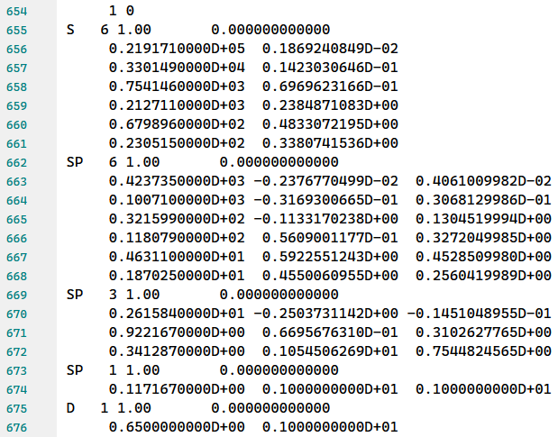

```python
import sys;sys.path.append('d:/code/pywfn')
```

# 文件读取
文件读取的核心任务是从化学文件中提取出计算分子性质时需要的信息，主要分为三类

- 结构信息
- 基组信息
- 轨道信息

所有的读取器都包含在`pywfn.reader`中，当前支持的读取器及支持的信息如下：

|读取类|结构信息|基组信息|轨道信息|说明|
|:---:|:---:|:---:|:---:|:---:|
|`LogReader`|√|?|?|读取高斯的输出文件|
|`GjfReader`|√|×|×|读取高斯的输入文件|
|`FchReader`|√|√|√|读取高斯的检查点文件|
|`ModReader`|√|√|√|读取`.molden`文件|
|`XyzReader`|√|×|×|读取`.sdf`文件|
|`MolReader`|√|×|×|读取`.mol`文件|
|`SdfReader`|√|×|×|读取`.sdf`文件|
|`AnyReader`|?|?|?|可自定义信息|

## 信息详情

### 结构信息

包含原子的`类型`和`坐标`，以常见的高斯输入文件类型`gjf`为例

```
%chk=D:\gfile\C6H6.chk
# b3lyp/6-31g(d) pop=full gfinput iop(3/33=1)

Title Card Required

0 1
 C                  0.00000000    1.40140000   -0.00000000
 C                 -1.21364800    0.70070000   -0.00000000
 C                 -1.21364800   -0.70070000   -0.00000000
 C                  0.00000000   -1.40140000   -0.00000000
 C                  1.21364800   -0.70070000   -0.00000000
 C                  1.21364800    0.70070000   -0.00000000
 H                  0.00000000    2.47140000   -0.00000000
 H                 -2.14029518    1.23570000   -0.00000000
 H                 -2.14029518   -1.23570000   -0.00000000
 H                  0.00000000   -2.47140000   -0.00000000
 H                  2.14029518   -1.23570000   -0.00000000
 H                  2.14029518    1.23570000   -0.00000000


```
其中存储着原子的元素符号，即为原子类型，以及原子的xyz坐标，即原子坐标。

不同类型的文件存储使用的原子坐标的单位不同，可以为`Angstorm`或`Borh`，pywfn内部统一转为`Borh`单位。

### 基组信息
包含高斯型基函数的系数和指数

以`6-31g(d)`基组为例：



- `654`行中的`1`代表当前基组信息属于第一个原子
- `655`行中`S`代表`1S`轨道，`6`代表`1S`轨道有`6`个GTO函数线性组合而成
- `656-611`中两列数据分别代表GTO函数的`指数`和`系数`
- `662`行中的`SP`代表`2S`和`2P`轨道，分别也是有`6`个GTO函数线性组合而成
- `663-668`中，第一列和第二列为`2S`和`2P`的GTO指数，第三列代表两者共享的系数
- 其它的也都是类似的

### 轨道信息


轨道信息主要就是与分子轨道相关的信息，主要包含：

- 轨道系数矩阵。分为开窍层和闭壳层。形状为[nato,nobt]，对于闭壳层，nato=nobt；对于开窍层，nato*2=nobt
- 分子轨道-能量。长度为nobt的浮点数列表。
- 分子轨道-占据。长度为nobt的布尔值列表。表示分子轨道是否占据
- 原子轨道-原子索引。每个原子轨道对应的原子索引
- 原子轨道-轨道壳层。原子轨道对应的壳层索引。
- 原子轨道-轨道符号。每个原子轨道的轨道符号。可以为：`S`、`PX`、`PY`、`PZ` 等等

这些信息都存储在`base.Coef`类型中

直接读取到的原子轨道信息混合了`笛卡尔型基函数`和`球谐型基函数`，在Coef类型中可以将转为全部为笛卡尔型或者全部为球谐型。

## fch文件

**示例代码**


```python
from pywfn.base import Mole
from pywfn.reader import FchReader

reader=FchReader('./mols/C6H6.fch')
mol=Mole(reader)

print(mol.geome)
print(mol.basis)
print(mol.coefs)
```

      C   -0.0000    2.6483    0.0000
      C    2.2935    1.3241    0.0000
      C    2.2935   -1.3241    0.0000
      C    0.0000   -2.6483    0.0000
      C   -2.2935   -1.3241    0.0000
      C   -2.2935    1.3241    0.0000
      H   -0.0000    4.6703    0.0000
      H    4.0446    2.3351    0.0000
      H    4.0446   -2.3351    0.0000
      H    0.0000   -4.6703    0.0000
      H   -4.0446   -2.3351    0.0000
      H   -4.0446    2.3351    0.0000
      idx  atm  shl  ang         coe         alp
        1    1    1    0  1.8347e-03  3.0475e+03
        2    1    1    0  1.4037e-02  4.5737e+02
        3    1    1    0  6.8843e-02  1.0395e+02
        4    1    1    0  2.3218e-01  2.9210e+01
        5    1    1    0  4.6794e-01  9.2867e+00
     ... ... ... ...       .....       .....
      111   12    1    0  3.3495e-02  1.8731e+01
      112   12    1    0  2.3473e-01  2.8254e+00
      113   12    1    0  8.1376e-01  6.4012e-01
      114   12    2    0  1.0000e+00  1.6128e-01
    
                            O         O         O         O         O     .....         V         V         V         V         V
                     -10.1865  -10.1863  -10.1863  -10.1857  -10.1857     .....    4.1203    4.1203    4.3331    4.3331    4.6661
        1    1    S    0.4051    0.5731    0.0000    0.0000    0.5733     .....   -0.2807    0.0000   -0.2810    0.0000   -0.2153
        1    2    S    0.0198    0.0284    0.0000    0.0000    0.0289     .....    1.7241    0.0000    1.6543    0.0000    1.0179
        1    2   PX    0.0000    0.0000   -0.0003   -0.0002    0.0000     .....    0.0000    0.1842    0.0000    0.1850    0.0000
        1    2   PY    0.0001   -0.0000    0.0000    0.0000   -0.0002     .....    0.0332    0.0000    0.1526    0.0000    0.1565
                        .....     .....     .....     .....     .....     .....     .....     .....     .....     .....     .....
        1    2   PZ    0.0000    0.0000    0.0000    0.0000    0.0000     .....    0.0000    0.0000    0.0000    0.0000    0.0000
       10    2    S    0.0009   -0.0010    0.0000    0.0000    0.0007     .....    0.1835    0.0000   -0.1784    0.0000   -0.1325
       11    1    S   -0.0002    0.0001    0.0002   -0.0002    0.0001     .....   -0.0611   -0.1059   -0.0495    0.0858    0.0919
       11    2    S    0.0009   -0.0005   -0.0008    0.0006   -0.0004     .....    0.0917    0.1589    0.0892   -0.1545    0.1325
       12    1    S   -0.0002   -0.0001    0.0002    0.0002    0.0001     .....    0.0611   -0.1059   -0.0495   -0.0858   -0.0919
       12    2    S    0.0009    0.0005   -0.0008   -0.0006   -0.0004     .....   -0.0917    0.1589    0.0892    0.1545   -0.1325
    
    

## gjf文件

**示例代码**


```python
from pywfn.base import Mole
from pywfn.reader import GjfReader

reader=GjfReader('./mols/C6H6.gjf')
mol=Mole(reader)

print(mol.geome)
```

      C    0.0000    2.6472    0.0000
      C    2.2926    1.3236    0.0000
      C    2.2926   -1.3236    0.0000
      C    0.0000   -2.6472    0.0000
      C   -2.2926   -1.3236    0.0000
      C   -2.2926    1.3236    0.0000
      H    0.0000    4.6685    0.0000
      H    4.0430    2.3342    0.0000
      H    4.0430   -2.3342    0.0000
      H    0.0000   -4.6685    0.0000
      H   -4.0430   -2.3342    0.0000
      H   -4.0430    2.3342    0.0000
    

## log文件
高斯的输出文件，后缀可以为`.log`或`.out`，进行波函数分析时需要加入关键词：`pop=full gfinput iop(3/33=1)`

**示例代码**


```python
from pywfn.base import Mole
from pywfn.reader import LogReader

reader=LogReader('./mols/C6H6.out')
mol=Mole(reader)

print(mol.geome)
print(mol.basis)
print(mol.coefs)
```

      C    0.0000    2.6483    0.0000
      C    2.2935    1.3241    0.0000
      C    2.2935   -1.3241    0.0000
      C    0.0000   -2.6483    0.0000
      C   -2.2935   -1.3241    0.0000
      C   -2.2935    1.3241    0.0000
      H    0.0000    4.6703    0.0000
      H    4.0446    2.3351    0.0000
      H    4.0446   -2.3351    0.0000
      H    0.0000   -4.6703    0.0000
      H   -4.0446   -2.3351    0.0000
      H   -4.0446    2.3351    0.0000
      idx  atm  shl  ang         coe         alp
        1    1    1    0  1.8347e-03  3.0475e+03
        2    1    1    0  1.4037e-02  4.5737e+02
        3    1    1    0  6.8843e-02  1.0395e+02
        4    1    1    0  2.3218e-01  2.9210e+01
        5    1    1    0  4.6794e-01  9.2867e+00
     ... ... ... ...       .....       .....
      111   12    1    0  3.3495e-02  1.8731e+01
      112   12    1    0  2.3473e-01  2.8254e+00
      113   12    1    0  8.1376e-01  6.4012e-01
      114   12    2    0  1.0000e+00  1.6128e-01
    
                            O         O         O         O         O     .....         V         V         V         V         V
                     -10.1865  -10.1862  -10.1862  -10.1857  -10.1857     .....    4.1203    4.1203    4.3331    4.3331    4.6661
        1    1    S    0.4051    0.5731    0.0000    0.0000    0.5733     .....   -0.2807    0.0000   -0.2810    0.0000   -0.2153
        1    2    S    0.0198    0.0284    0.0000    0.0000    0.0289     .....    1.7241    0.0000    1.6543    0.0000    1.0179
        1    2   PX    0.0000    0.0000   -0.0003   -0.0002    0.0000     .....    0.0000    0.1842    0.0000    0.1850    0.0000
        1    2   PY    0.0001   -0.0000    0.0000    0.0000   -0.0002     .....    0.0331    0.0000    0.1526    0.0000    0.1565
                        .....     .....     .....     .....     .....     .....     .....     .....     .....     .....     .....
        1    2   PZ    0.0000    0.0000    0.0000    0.0000    0.0000     .....    0.0000    0.0000    0.0000    0.0000    0.0000
       10    2    S    0.0009   -0.0010    0.0000    0.0000    0.0007     .....    0.1835    0.0000   -0.1784    0.0000   -0.1325
       11    1    S   -0.0002    0.0001    0.0002   -0.0002    0.0001     .....   -0.0611   -0.1059   -0.0495    0.0858    0.0919
       11    2    S    0.0009   -0.0005   -0.0008    0.0006   -0.0003     .....    0.0917    0.1589    0.0892   -0.1545    0.1325
       12    1    S   -0.0002   -0.0001    0.0002    0.0002    0.0001     .....    0.0611   -0.1059   -0.0495   -0.0858   -0.0919
       12    2    S    0.0009    0.0005   -0.0008   -0.0006   -0.0003     .....   -0.0917    0.1589    0.0892    0.1545   -0.1325
    
    

## molden文件
一种存储波函数信息的常见文件类型

**示例代码**


```python
from pywfn.base import Mole
from pywfn.reader import ModReader

reader=ModReader('./mols/C6H6.molden')
mol=Mole(reader)

print(mol.geome)
print(mol.basis)
print(mol.coefs)
```

      C    2.6342    0.1583   -0.0000
      C    1.1799    2.3604   -0.0001
      C   -1.4541    2.2020    0.0001
      C   -2.6342   -0.1584   -0.0000
      C   -1.1800   -2.3604   -0.0001
      C    1.4542   -2.2020    0.0001
      H    4.6835    0.2816    0.0000
      H    2.0980    4.1967   -0.0001
      H   -2.5856    3.9151    0.0002
      H   -4.6836   -0.2814    0.0000
      H   -2.0979   -4.1968   -0.0001
      H    2.5854   -3.9152    0.0001
      idx  atm  shl  ang         coe         alp
        1    1    1    0  1.8347e-03  3.0475e+03
        2    1    1    0  1.4037e-02  4.5737e+02
        3    1    1    0  6.8843e-02  1.0395e+02
        4    1    1    0  2.3218e-01  2.9210e+01
        5    1    1    0  4.6794e-01  9.2867e+00
     ... ... ... ...       .....       .....
      117   12    1    0  2.3473e-01  2.8254e+00
      118   12    1    0  8.1376e-01  6.4012e-01
      119   12    2    0  1.0000e+00  1.6128e-01
      120   12    3    1  1.0000e+00  1.1000e+00
    
                            O         O         O         O         O     .....         V         V         V         V         V
                     -10.1795  -10.1793  -10.1793  -10.1789  -10.1789     .....    3.2510    3.3973    3.5233    3.5234    3.9865
        1    1    S   -0.4056   -0.5118   -0.2644    0.5104    0.2604     .....   -0.0128    0.0000    0.0214   -0.0306   -0.0227
        1    2    S   -0.0131   -0.0182   -0.0094    0.0197    0.0101     .....    0.1385   -0.0001   -0.0929    0.1327   -0.0584
        1    3    S    0.0047    0.0092    0.0048   -0.0179   -0.0092     .....    0.1218   -0.0001   -0.2699    0.3856    0.7233
        1    4   PX   -0.0007   -0.0002   -0.0000   -0.0004   -0.0002     .....    0.1973   -0.0206   -0.2317    0.3438    0.2731
                        .....     .....     .....     .....     .....     .....     .....     .....     .....     .....     .....
        1    4   PY   -0.0000    0.0005   -0.0011    0.0004   -0.0008     .....   -0.0721    0.3447   -0.1144   -0.0496    0.0164
       12    1    S    0.0009    0.0001    0.0013    0.0000    0.0010     .....   -0.4703   -0.0001   -0.5633   -0.0490    0.4233
       12    2    S   -0.0017   -0.0001   -0.0012   -0.0000   -0.0008     .....   -0.4535   -0.0000   -0.4075   -0.0355    0.1650
       12    3   PX   -0.0004    0.0000   -0.0006   -0.0001   -0.0006     .....    0.4477    0.3002    0.4228   -0.0322   -0.2640
       12    3   PY    0.0006    0.0001    0.0009   -0.0000    0.0009     .....   -0.6735    0.1980   -0.6274   -0.1002    0.3999
       12    3   PZ   -0.0000   -0.0000   -0.0000   -0.0000   -0.0000     .....    0.0000    0.0000    0.0000   -0.0000   -0.0000
    
    

## mol文件
存储分子结合结构的文件

**示例代码**


```python
from pywfn.base import Mole
from pywfn.reader import MolReader

reader=MolReader('./mols/C6H6.mol')
mol=Mole(reader)

print(mol.geome)
```

    12
      C    0.0000    2.6472    0.0000
      C    2.2925    1.3236    0.0000
      C    2.2925   -1.3236    0.0000
      C    0.0000   -2.6472    0.0000
      C   -2.2925   -1.3236    0.0000
      C   -2.2925    1.3236    0.0000
      H    0.0000    4.6685    0.0000
      H    4.0430    2.3342    0.0000
      H    4.0430   -2.3342    0.0000
      H    0.0000   -4.6685    0.0000
      H   -4.0430   -2.3342    0.0000
      H   -4.0430    2.3342    0.0000
    

## sdf文件
包含分子几何结构信息的文件类型

**示例代码**


```python
from pywfn.base import Mole
from pywfn.reader import SdfReader

reader=SdfReader('./mols/C6H6.sdf')
mol=Mole(reader)

print(mol.geome)
```

      C    0.0000    2.6483    0.0000
      C    2.2934    1.3241    0.0000
      C    2.2934   -1.3241    0.0000
      C    0.0000   -2.6483    0.0000
      C   -2.2934   -1.3241    0.0000
      C   -2.2934    1.3241    0.0000
      H    0.0000    4.6703    0.0000
      H    4.0446    2.3351    0.0000
      H    4.0446   -2.3351    0.0000
      H    0.0000   -4.6703    0.0000
      H   -4.0446   -2.3351    0.0000
      H   -4.0446    2.3351    0.0000
    

## xyz文件
包含分子结构信息的文件类型

`.xyz`文件可以包含多个结构，pywfn默认读取最后一个结构

**示例代码**


```python
from pywfn.base import Mole
from pywfn.reader import XyzReader

reader=XyzReader('./mols/C6H6.xyz')
mol=Mole(reader)

print(mol.geome)
```

      C    0.0000    1.4014    0.0000
      C    1.2136    0.7007    0.0000
      C    1.2136   -0.7007    0.0000
      C    0.0000   -1.4014    0.0000
      C   -1.2136   -0.7007    0.0000
      C   -1.2136    0.7007    0.0000
      H    0.0000    2.4714    0.0000
      H    2.1403    1.2357    0.0000
      H    2.1403   -1.2357    0.0000
      H    0.0000   -2.4714    0.0000
      H   -2.1403   -1.2357    0.0000
      H   -2.1403    1.2357    0.0000
    
